## Lab 8

#### Zadanie 1

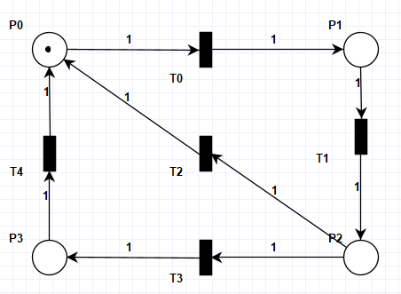

**Graf osiągalności**
Mamy 4 stany, 1 token i 4 możliwych posiadaczy tego tokenu więc każdy stan reprezentuje posiadanie tokenu w konkretnym miejscu.
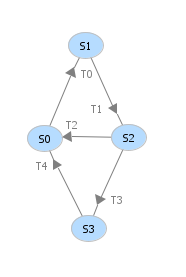

1. Jakie znakowania są osiągalne?
    - Wszystkie znakowania są osiągalne.
2. Ile wynosi maksymalna liczba znaczników w każdym ze znakowań? Jakie możemy wyciągnąć z tego wnioski n.t. ograniczoności i bezpieczeństwa?
    - Niezależnie od znakowania maksymalna liczba znaczników wynosi 1.
    - Na tej podstawie możemy wywnioskować, że sieć jest 1-ograniczona i przez to także bezpieczna.
3. Czy każde przejście jest przedstawione jako krawędź w grafie? Jaki z tego wniosek n.t. żywotności przejść?
    - Każde przejście jest przedstawione w grafie jako krawędź.
    - Jesteśmy w stanie wykorzystać każde możliwe przejście więc wszystkie przejścia są żywe.
4. Czy wychodząc od dowolnego węzła grafu (znakowania) mona wykonać dowolne przejście? Jaki z tego wniosek n.t. żywotności sieci? Czy są możliwe zakleszczenia?
    - Tak, możliwe jest wykonanie dowolnego przejścia.
    - Sieć jest żywa.
    - Zakleszczenie nie jest możliwe.

**Analiza niezmienników**

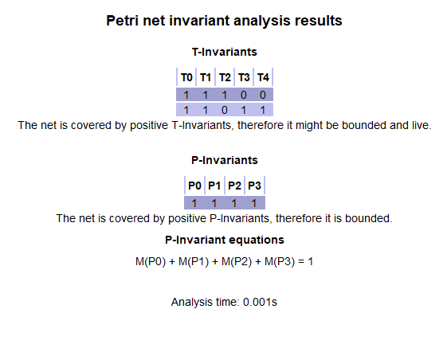

1. Analiza niezmienników przejść (T-invariants)
    - Sieć posiada dwa możliwe cykle przejść, co wskazuje na jej odwracalność. Dzięki temu sieć może powrócić do stanu początkowego z dowolnego osiągalnego stanu.
2. Analiza niezmienników miejsc (P-invariants)
    - Dla każdego znakowania osiągalnego ze znakowania początkowego ilość znaczników w sieci jest stała i wynosi 1. Sieć jest zatem zachowawcza.

#### Zadanie 2 

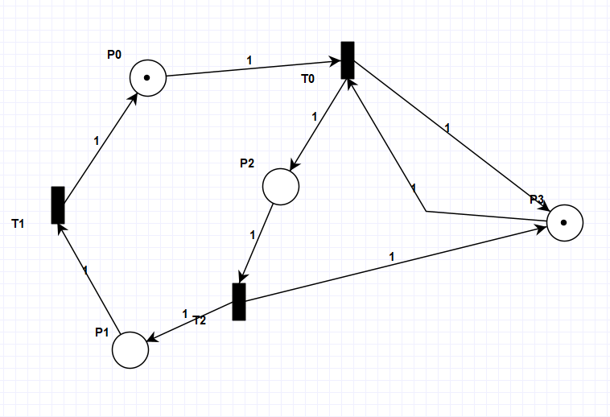

Po kilku iteracjach tokeny nagromadziły się w P3:
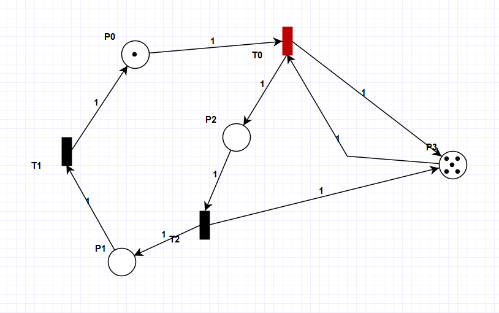

**Analiza niezmienników**
Tranzycja T2 będzie ciągle namnażać znaczniki w miejscu P3. Nie da się wrócić do znakowania początkowego zatem sieć nie jest odwracalna.
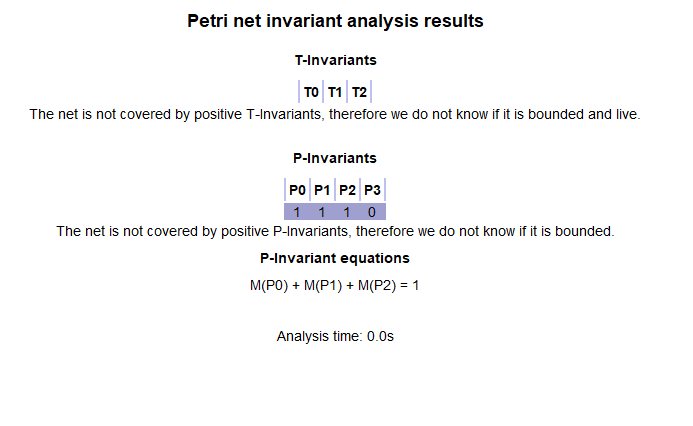

**Graf osiągalności**

1. Czy sieć jest żywa?
    - Tak, sieć jest żywa, ponieważ niezależnie od braku ograniczoności miejsca P3, z dowolnego znakowania uzyskanego, ze znakowania początkowego będziemy mogli wykonać ciąg tranzycji umożliwiający odpalenie dowolnej z nich.
2. Czy sieć jest ograniczona?
    - Sieć nie jest ograniczona ponieważ odpalenie tranzycji T2 nieodwracalnie dodaje znacznik do miejsca P1. Zatem pomimo tego, że miejsca P0, P2 oraz P3 są 1-ograniczone to przez brak ograniczoności P3 sieć nie jest ograniczona i przez to także nie jest bezpieczna

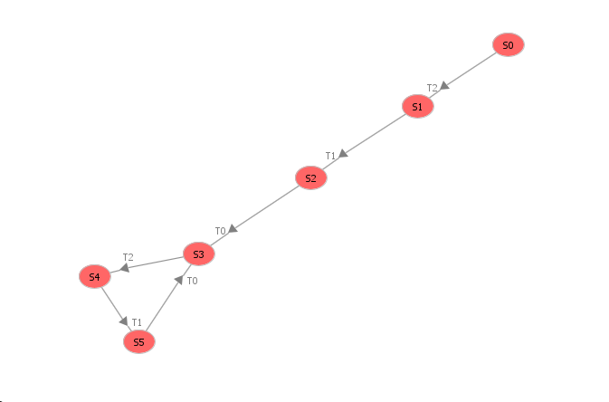

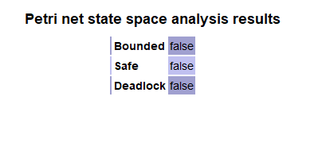

#### Zadanie 3

Wzajemne wykluczenie:
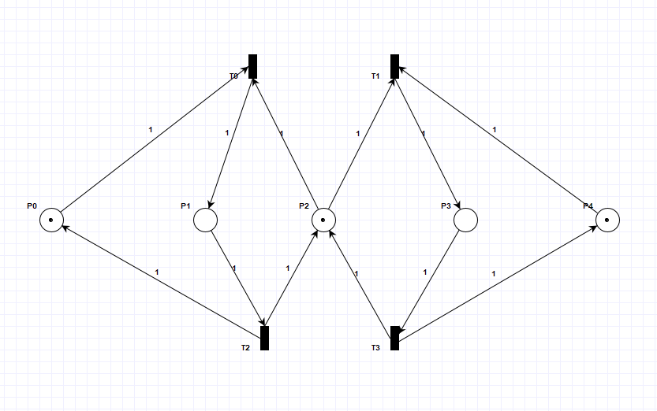

**Analiza niezmienników**

1. Wyjaśnić znaczenie równań.
    - W parach (P0, P1) oraz (P3, P4) zawsze będzie po 1 znaczniku - wynika to z pierwszego i trzeciego równania. 
2. Które równanie pokazuje działanie ochrony sekcji krytycznej?
    - Sekcje krytyczną oznacza równanie które mówi że zasób jest wolny wtedy znacznik znajduje się w P2 albo jest zajęty przez jeden ze stanów P1, P3.
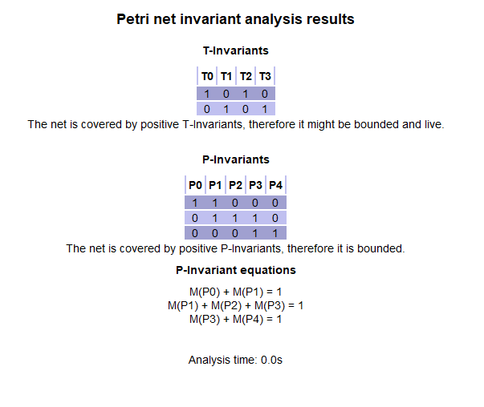

#### Zadania 4

Problem Producent-Konsument:
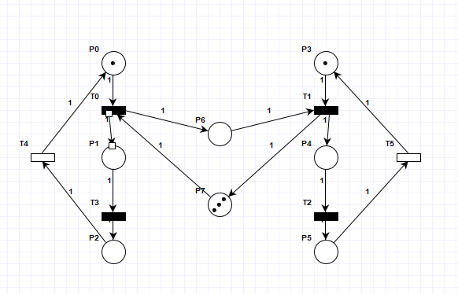

**Analiza niezmienników**

1. Które równanie mówi nam o rozmiarze bufora?
    - Równanie 3 mówi o rozmiarze bufora - M(P6) + M(P7) = 3.
2. Czy siec jest zachowawcza?
    - Tak sieć jest zachowawcza, ponieważ liczba tokenów w sieci jest stała i wynosi 5. Każda tranzycja ma tyle samo wejść co wyjść.
    
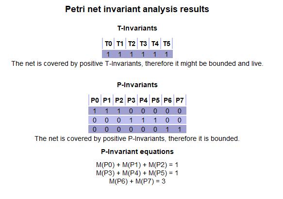

#### Zadania 5

Problemu Producent-Konsumet z nieskończonym buforem (po lewej producent, po prawej konsument):
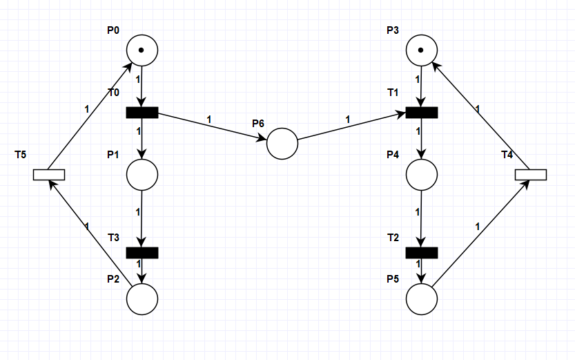

**Analiza niezmienników**

1. Zaobserwować brak pełnego pokrycia miejsc.
    - Ze względu na miejsce P6 sieć nie będzie ograniczona ani bezpieczna ponieważ to miejsce oznacza nieskończony bufor. Nie będzie zachowawcza bo tranzycja T0 produkuje tokeny.
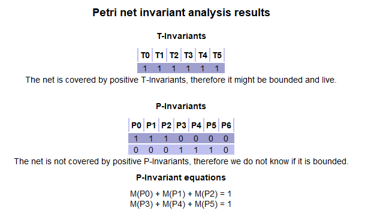

#### Zadanie 6

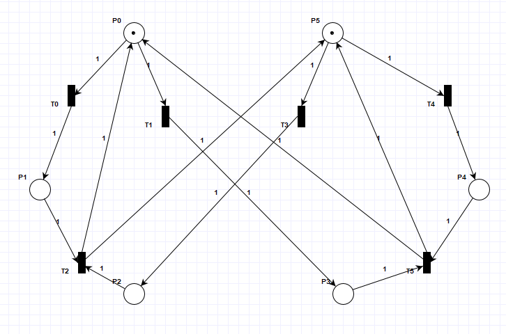

**Graf osiągalności**
Gdy dojdziemy do stanu S6 i S7 to dochodzi do zakleszczenia.
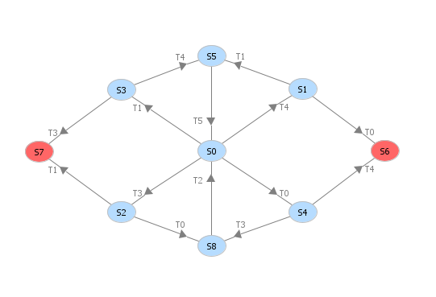

**Właściwości sieci**
- Sieć jest ograniczona bo każde z miejsc może mieć maksymalnie 1 token.
- Sieć jest bezpieczna bo jest 1-ograniczona.
- Może dojść do zakleszczenia.

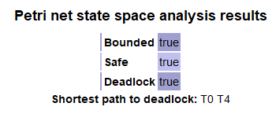